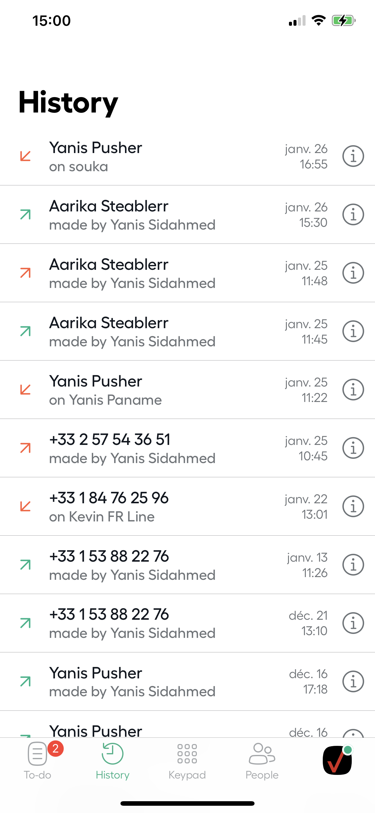
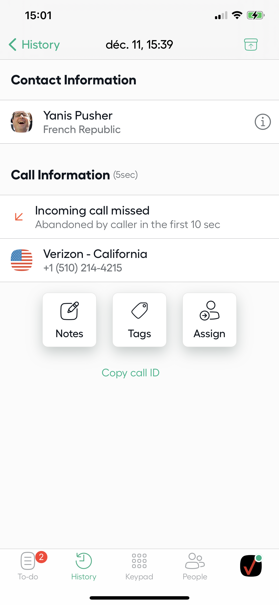

# Aircall - iOS Technical test

## Summary

Purpose of this test is to show how you develop and structure your code.

To do so, you will build a small Aircall iOS app from scratch.

> While it can be fun to test new frameworks/tools we remember you the objective is to evaluate your skills and reasoning.

### General rules

- Use the architecture you prefer
- Use any library you want
- Use **UIKit or SwiftUI**
- Your app need to be **compatible with iOS n-1**
  - for instance if iOS15 is the latest available version, your app need to support iOS14+

### Things you need to implement

1. Display a ****list of calls**** page
2. Click on call from the list will redirect to ****call details**** page
3. You should be able to ****archive a call**** from List and Details page
    - Archived calls will no longer be visible from ****list of calls****

| List of calls                 |  Call details               |
|-------------------------      |-------------------------    |
|  |  |

### Where to focus

1. We will pay attention on the architecture of your app
1. We favour simple maintainable code over over-engineering
2. The quality of your tests
3. The clarity and documentation of your code
4. Try to follow the screens design. No need for pixel perfect just match the essence.

## API documentation

### Routes

Here is the API address: https://aircall-job.herokuapp.com.

As you can see, it's hosted on a free Heroku server, which means that the first time you will fetch the API, it will take few seconds to answer.

| Service | Method | URL |
|-----|------|------|
| Activity Feed | GET | https://aircall-job.herokuapp.com/activities |
| Retrieve a Specific call | GET | https://aircall-job.herokuapp.com/activities/:id |
| Update a call* | POST | https://aircall-job.herokuapp.com/activities/:id
| Reset all calls to initial state (useful after archiving) |  GET | https://aircall-job.herokuapp.com/reset

\* Only updatable field is `is_archived (bool)`

### Call object

- ****id**** - unique ID of call
- ****created_at**** - creation date
- ****direction**** - `inbound` or `outbound` call
- ****from**** - caller's number
- ****to**** - callee's number
- ****via**** - Aircall number used for the call
- ****duration**** - duration of a call (in seconds)
- ****is_archived**** - call is archived or not
- ****call_type**** - can be a `missed`, `answered` or `voicemail` call.

### Date

Webservice dates are using iso 8601 format (yyyy-MM-dd'T'HH:mm:ss.SSSZ).

## Submission instructions

**Neither fork the project nor submit a pull request.** When your project is done send us a zip by mail.

Don't forget to include a ****README**** file with the following:

- A brief outline of the architecture of your app
- Explain why you decided to use each third party libraries
- What was the most difficult part of the challenge?
- Estimate your percentage of completion and how much time you would need to finish

## Need help?

Don't hesitate to ask any question regarding the test at ios@aircall.io
